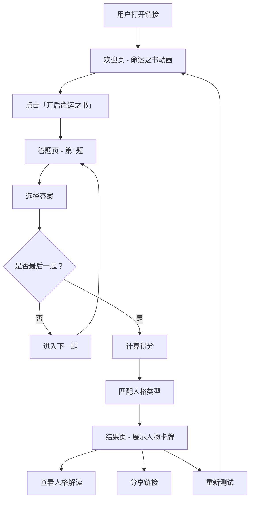

## 1. 产品概述

「命运之书」是一款黑金色神秘风格的在线性格测试游戏。用户通过回答50道精心设计的问题，最终解锁属于自己的专属人物卡牌。每张卡牌代表一种独特的人格类型，配有精美的角色插画与深度解读，用户可将结果分享给好友，邀请他人一同探索命运的奥秘。

- **核心目标**：提供沉浸式、仪式感强烈的性格测试体验，让用户在日常中获得一份独特的自我认知与社交谈资
- **目标用户**：18-35岁年轻群体，对神秘学、塔罗、奇幻题材感兴趣，热衷社交分享

## 2. 核心功能

### 2.1 用户角色
| 角色 | 注册方式 | 核心权限 |
|------|----------|----------|
| 访客 | 无需注册，直接访问链接 | 完整答题、查看结果、分享链接 |

### 2.2 功能模块
1. **欢迎页**：命运之书开场动画、测试引导文案、开始按钮
2. **答题页**：50道题目逐题展示、4选项选择、进度条、题目切换动画
3. **结果页**：人格卡牌展示、人格类型名称、深度解读、分享按钮、重新测试

### 2.3 页面详情
| 页面名称 | 模块名称 | 功能描述 |
|----------|----------|----------|
| 欢迎页 | 命运之书动画 | 书籍翻开动画，展示测试标题与副标题，背景为黑金粒子特效 |
| 欢迎页 | 引导文案 | 简要说明测试规则与玩法，营造神秘氛围 |
| 欢迎页 | 开始按钮 | 金色发光按钮，点击后进入答题页 |
| 答题页 | 进度条 | 顶部金色进度条，实时显示答题进度（1/50 ~ 50/50） |
| 答题页 | 题目区 | 题目卡片翻转/淡入动画，题目文字 + 4个选项按钮 |
| 答题页 | 选项按钮 | 黑底金边按钮，hover发光，选中后高亮，点击自动跳下一题 |
| 结果页 | 卡牌展示 | 卡牌正面：角色精美插画 + 人格名称；卡牌背面：详细解读 |
| 结果页 | 人格解读 | 人格类型描述、性格特点、适合领域、命运箴言 |
| 结果页 | 操作按钮 | 分享按钮（复制链接）、重新测试按钮 |

## 3. 核心流程

用户打开链接 → 进入欢迎页，观看命运之书开场动画 → 点击"开启命运之书"按钮 → 进入答题页，逐题作答（50题） → 完成所有题目 → 系统计算得分，匹配人格类型 → 展示专属人物卡牌 → 用户可查看人格解读、分享或重新测试

## 4. 用户界面设计

### 4.1 设计风格

- **主色调**：深黑（#0a0a0a）、暗金（#c9a84c）、亮金（#f0d060）
- **辅助色**：暗紫（#1a1025）、深棕（#2a1a10）、暗红点缀（#8b0000）
- **背景**：纯黑底色 + 金色粒子浮动效果 + 神秘纹理（曼陀罗、星图暗纹）
- **字体**：标题使用「Cinzel」衬线体（仪式感），正文使用「Cormorant Garamond」衬线体，数字使用「Playfair Display」
- **按钮风格**：金色描边 + 内发光 + hover时外发光扩散，圆角4px，略带复古质感
- **卡片风格**：暗色背景 + 金色边框 + 角装饰纹样 + 悬浮阴影
- **氛围元素**：金色粒子飘浮、微光闪烁、星芒点缀、烟雾/薄雾效果
- **图标**：使用lucide-react图标库，金色调

### 4.2 页面设计概览

| 页面名称 | 模块名称 | UI元素 |
|----------|----------|--------|
| 欢迎页 | 命运之书 | 中央一本翻开的古书，金色粒子从中飘出，书名"命运之书"以金色衬线字体显示 |
| 欢迎页 | 引导文案 | 书名下方展示副标题："五十道预言，揭示你灵魂深处的真实面目"，字体为Cormorant Garamond |
| 欢迎页 | 开始按钮 | 金色描边按钮，文字"开启命运之书"，hover时外发光扩散，点击有波纹效果 |
| 答题页 | 进度条 | 页面顶部金色细线进度条，左侧显示当前题号 |
| 答题页 | 题目区 | 中央卡片，黑色背景金色边框，题目文字淡入，选项逐个出现（staggered animation） |
| 答题页 | 选项按钮 | 4个选项按钮纵向排列，未选中时黑底金边，hover发金光，选中后金色填充 |
| 结果页 | 卡牌展示 | 大尺寸卡牌居中，正面为角色插画+人格名称，可翻转查看背面解读 |
| 结果页 | 操作区 | 卡牌下方金色按钮组：分享命运、再测一次 |

### 4.3 响应式设计
- 桌面端优先设计，布局居中，最大宽度480px
- 移动端自适应，卡片宽度自适应，选项按钮触控区域不小于44px
- 触摸设备优化：按钮增加触控反馈，粒子动画在低性能设备上降低密度

## 5. 人格类型体系（12种人格卡牌）

| ID | 人格名称 | 称号 | 关键词 | 主色调 |
|----|----------|------|--------|--------|
| 1 | 暗夜占星师 | 星辰的解读者 | 神秘、深邃、洞察 | 暗紫金 |
| 2 | 龙焰骑士 | 不灭的守护者 | 勇敢、正义、忠诚 | 赤金 |
| 3 | 深渊智者 | 永恒的求道者 | 智慧、冷静、博学 | 蓝金 |
| 4 | 影刃刺客 | 暗影中的独行者 | 敏捷、果断、独立 | 银黑 |
| 5 | 圣光贤者 | 灵魂的治愈者 | 慈悲、温和、治愈 | 白金 |
| 6 | 炼金术士 | 万物的转化者 | 创造、探索、变革 | 铜金 |
| 7 | 幻梦织者 | 梦境的主宰者 | 幻想、艺术、感性 | 粉金 |
| 8 | 暗夜领主 | 命运的掌控者 | 领导、威严、掌控 | 暗金 |
| 9 | 元素掌控者 | 自然的主宰者 | 平衡、力量、和谐 | 绿金 |
| 10 | 命运之轮 | 幸运的旅人 | 自由、冒险、乐观 | 橙金 |
| 11 | 虚空行者 | 深渊的思考者 | 孤独、深沉、哲理 | 灰金 |
| 12 | 星辰守护者 | 光明的引路者 | 希望、指引、光明 | 亮金 |

## 6. 题目设计（50题）

题目涵盖6个维度，每题4个选项，每个选项对应不同人格类型的权重：
- 内向/外向维度
- 理性/感性维度
- 冒险/谨慎维度
- 独立/依赖维度
- 领导/跟随维度
- 传统/创新维度

每道题围绕一个情景或偏好展开，选项设计为4个不同方向的回答，各人格类型在不同题目中通过权重累积得分。