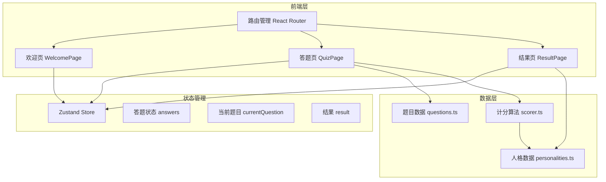

## 1. 架构设计



## 2. 技术选型

- **前端框架**：React@18 + TypeScript
- **构建工具**：Vite
- **样式方案**：Tailwind CSS@3 + 自定义CSS变量
- **状态管理**：Zustand
- **路由**：React Router DOM v6
- **图标**：lucide-react
- **动画**：Framer Motion
- **后端**：无（纯前端静态应用，可直接部署到任何静态托管服务）
- **部署**：支持一键部署到 Vercel / Netlify / GitHub Pages

## 3. 路由定义

| 路由 | 页面组件 | 用途 |
|------|----------|------|
| / | WelcomePage | 欢迎页，命运之书开场 |
| /quiz | QuizPage | 答题页，50道题目 |
| /result | ResultPage | 结果页，人格卡牌展示 |

## 4. 项目目录结构

```
src/
├── components/
│   ├── WelcomePage.tsx          # 欢迎页
│   ├── QuizPage.tsx             # 答题页
│   ├── ResultPage.tsx           # 结果页
│   ├── ProgressBar.tsx          # 进度条组件
│   ├── QuestionCard.tsx         # 题目卡片组件
│   ├── OptionButton.tsx         # 选项按钮组件
│   ├── PersonalityCard.tsx      # 人格卡牌组件（3D翻转）
│   ├── ParticleBackground.tsx   # 粒子背景组件
│   └── ShareButton.tsx          # 分享按钮组件
├── hooks/
│   └── useScrollToTop.ts        # 滚动到顶部hook
├── store/
│   └── quizStore.ts             # Zustand 状态管理
├── data/
│   ├── questions.ts             # 50道题目数据
│   ├── personalities.ts         # 12种人格类型数据
│   └── scorer.ts                # 计分算法
├── utils/
│   └── share.ts                 # 分享工具函数
├── App.tsx                      # 根组件
├── main.tsx                     # 入口文件
└── index.css                    # 全局样式 + Tailwind
```

## 5. 数据模型

### 5.1 题目数据结构
```typescript
interface Question {
  id: number;
  text: string;
  options: Option[];
}

interface Option {
  id: string;        // 'A' | 'B' | 'C' | 'D'
  text: string;
  weights: Record<number, number>; // { personalityId: weight } 人格类型权重
}
```

### 5.2 人格类型数据结构
```typescript
interface Personality {
  id: number;
  name: string;           // 人格名称
  title: string;          // 称号
  subtitle: string;       // 副标题
  description: string;    // 详细描述
  traits: string[];       // 性格特点列表
  suitableFields: string[]; // 适合领域
  motto: string;          // 命运箴言
  color: string;          // 主色调
  accentColor: string;    // 强调色
  cardImage: string;      // 卡牌插画描述（用于AI生成图片）
}
```

### 5.3 Zustand Store 结构
```typescript
interface QuizState {
  currentQuestion: number;           // 当前题目索引 (0-49)
  answers: Record<number, string>;   // { questionId: optionId }
  result: Personality | null;        // 计算结果
  isStarted: boolean;                // 是否已开始
  isCompleted: boolean;              // 是否已完成
  // Actions
  startQuiz: () => void;
  selectAnswer: (questionId: number, optionId: string) => void;
  nextQuestion: () => void;
  calculateResult: () => void;
  resetQuiz: () => void;
}
```

## 6. 计分算法

每个选项对12种人格类型有不同的权重（0-3分）。用户选择答案后，累加对应人格类型的得分。50题答完后，得分最高的人格类型即为用户结果。若出现平局，取最后得分的类型。

```typescript
function calculateResult(answers: Record<number, string>): Personality {
  const scores: Record<number, number> = {}; // { personalityId: totalScore }
  // 初始化所有人格类型得分为0
  for (let i = 1; i <= 12; i++) scores[i] = 0;
  // 遍历所有答案，累加权重
  Object.entries(answers).forEach(([questionId, optionId]) => {
    const question = getQuestion(Number(questionId));
    const option = question.options.find(o => o.id === optionId);
    if (option) {
      Object.entries(option.weights).forEach(([pid, weight]) => {
        scores[Number(pid)] += weight;
      });
    }
  });
  // 找出最高分人格类型
  const maxScore = Math.max(...Object.values(scores));
  const winnerId = Object.entries(scores).find(([, s]) => s === maxScore)![0];
  return getPersonality(Number(winnerId));
}
```

## 7. 卡牌插画方案

12种人格卡牌的插画通过以下方式生成：
- 使用 `text_to_image` API 根据每种人格的详细描述生成对应风格的插画
- 图片尺寸：portrait_4_3，适合卡牌比例
- 每张图强调黑金神秘风格，体现对应人格的气质特征